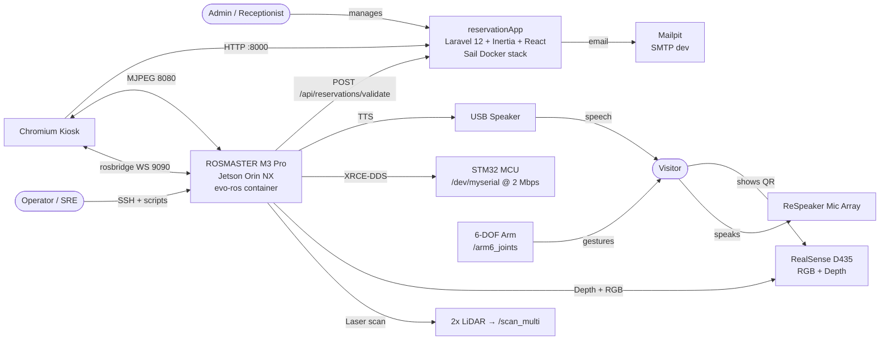
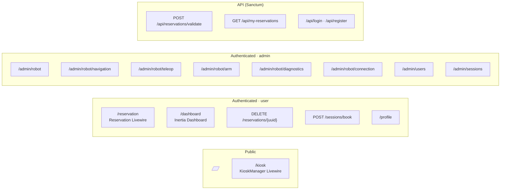
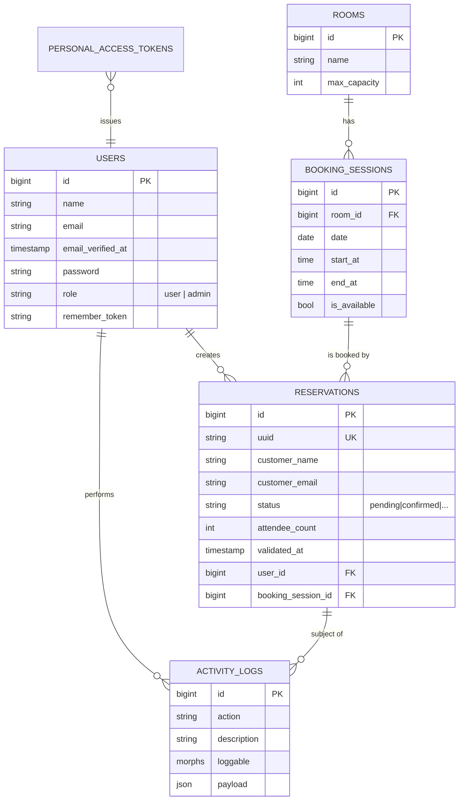
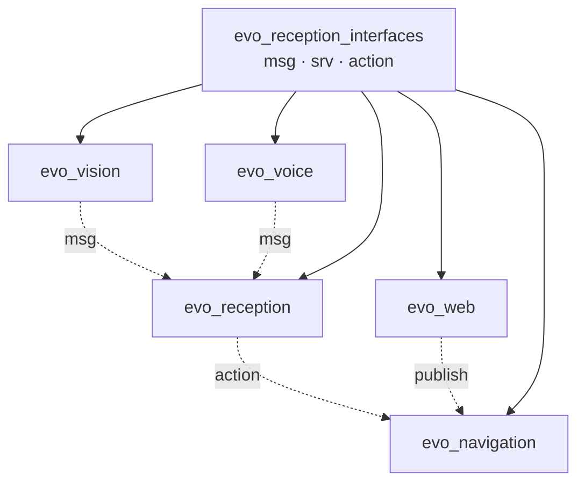
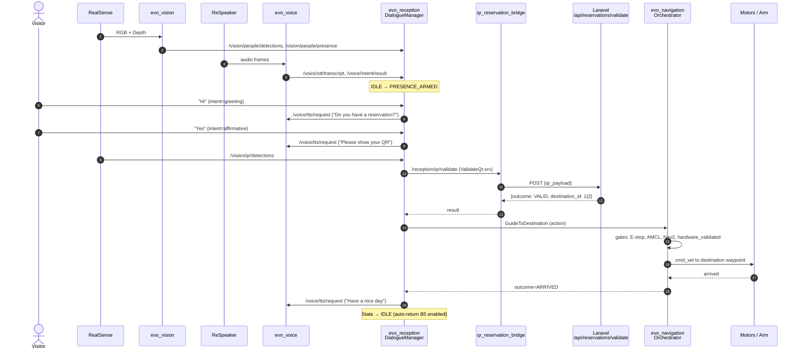
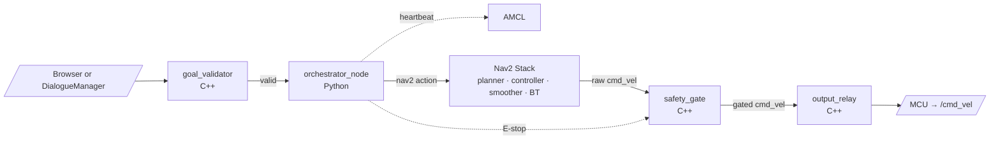
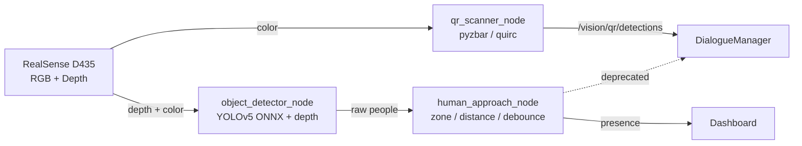
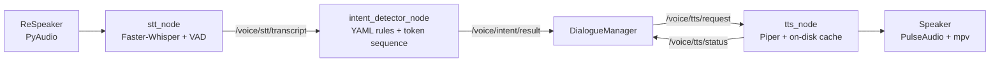
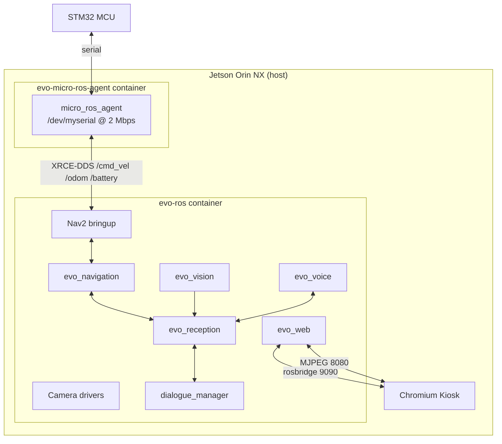
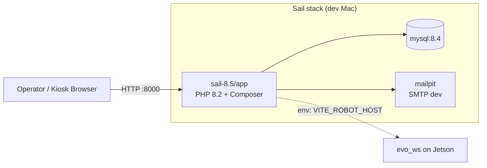

# Evo-Botics (RAA) — System Architecture

> **Status:** Living document, generated from source as of branch `refacto_and_cleanup` (HEAD `481b4e2`).
> **Scope:** End-to-end architecture of the autonomous reception robot: web application, ROS 2 runtime, hardware, contracts, deployment, and operations.

---

## 1. Executive Summary

**Evo-Botics (RAA — Robot Autonomous d'Accueil)** is a HETIC Web 3 student project that delivers an **autonomous reception robot for business centers**. The robot greets visitors, validates QR-coded reservations against a central backend, guides the visitor to the booked meeting room, and returns to its base station.

The system is composed of **two coupled applications** that share a strict contract:

| Application | Stack | Where it runs | Responsibility |
|---|---|---|---|
| **reservationApp** | Laravel 12 · Inertia.js 2 · React 18 · TypeScript · Tailwind 3 · Livewire 4 · MySQL 8.4 | Dev Mac (or server) | Business logic, reservation CRUD, QR signing, multilingual kiosk, admin dashboard |
| **evo_ws** | ROS 2 Humble · Python 3 (rclpy) · C++ (rclcpp) · Nav2 · YOLOv5 · Whisper · Piper TTS | NVIDIA Jetson Orin NX on ROSMASTER M3 Pro | Real-time perception, navigation, voice I/O, dialogue, safety |

A single **`scripts/robot.sh`** orchestrator (≈865 lines) plus **`scripts/robot/lib.sh`** (≈1 909 lines) binds the ROS workspace, custom Docker image, and kiosk browser into one-command demos (`./scripts/robot.sh demo home|school`).

---

## 2. High-Level System Context (C4 Level 1)



**Key external contracts:**
- HTTP contract between robot ↔ web app (reservation validation only — the web app is the source of truth).
- WebSocket rosbridge contract between kiosk browser ↔ robot (telemetry, arm commands, navigation goals).
- DDS contract between ROS nodes inside the robot (topics, services, actions — see §6).

---

## 3. Layered Architecture (C4 Level 2)

```mermaid
flowchart TB
  subgraph People
    V[Visitor]
    A[Admin]
    O[Operator]
  end

  subgraph "Web Tier (reservationApp)"
    direction TB
    subgraph "Browser SPA (React + Inertia)"
      KioskUI[Kiosk Livewire]
      DashUI[Dashboard]
      AdminUI[Admin / Robot]
      RobotHooks[hooks/useRosBridge<br/>hooks/useRobotTelemetry]
    end
    subgraph "Server (Laravel 12)"
      Routes[Web + API Routes]
      Middleware[auth / admin / locale]
      Livewire[Livewire 4 components]
      Controllers[ReservationController<br/>BookingSessionController<br/>UserManagementController]
      DomainModels[Eloquent Models<br/>User · Reservation · BookingSession · Room · ActivityLog]
      QRService[ReservationQrPayload<br/>HMAC-SHA256]
      Mail[ReservationConfirmed]
    end
    subgraph "Persistence"
      MySQL[(MySQL 8.4)]
    end
  end

  subgraph "Robot Tier (evo_ws)"
    direction TB
    subgraph "Perception"
      Vision[evo_vision<br/>QR · YOLO · Depth]
    end
    subgraph "Voice"
      Voice[evo_voice<br/>STT · Intent · TTS]
    end
    subgraph "Cognition"
      Reception[evo_reception<br/>DialogueManager FSM<br/>QR Bridge · Guide Action]
    end
    subgraph "Navigation & Safety"
      Nav[evo_navigation<br/>Nav2 · SLAM · E-stop · Orchestrator]
    end
    subgraph "Web Bridge"
      Web[evo_web<br/>rosbridge · camera HTTP · arm relay]
    end
    subgraph "Shared"
      Ifaces[evo_reception_interfaces<br/>msg · srv · action]
    end
    subgraph "Hardware Abstraction"
      Drivers[ROS Drivers<br/>Realsense · ira_laser_tools · micro-ROS]
    end
  end

  subgraph "Hardware"
    HW[LiDAR · RealSense · Mic · Speaker · Arm · MCU]
  end

  V --> KioskUI
  A --> AdminUI
  O --> RobotHooks

  KioskUI --> Livewire --> Controllers --> DomainModels --> MySQL
  DashUI --> Controllers
  AdminUI --> Controllers
  AdminUI --> RobotHooks
  RobotHooks <-->|WS 9090| Web
  RobotHooks -->|MJPEG 8080| Web

  Vision --> Ifaces
  Voice --> Ifaces
  Reception --> Ifaces
  Nav --> Ifaces
  Web --> Ifaces

  Vision --> Drivers --> HW
  Voice --> Drivers
  Nav --> Drivers
  Reception --> Nav
  Reception --> Web

  Reception -->|HTTP /api/reservations/validate| Controllers
```

**Architectural principles observed in the codebase:**
- **State machine isolation** — `dialogue_manager.py` is a pure FSM (no ROS imports), testable in isolation; the `dialogue_manager_node.py` is the thin ROS adapter.
- **Fail-closed navigation** — `ReceptionNavReadinessChecker` rejects requests when `hardware_validated: false`, `allow_real_navigation: false`, AMCL is not localized, E-stop is active, or Nav2 is not ready.
- **Browser never drives hardware directly** — arm commands go to `/evo/arm/command` (volatile) and the native `arm_command_relay_node` re-publishes them to `/arm6_joints` with per-joint clamping.
- **Two-way contract is minimal** — the only HTTP coupling is `POST /api/reservations/validate`. Everything else is shared through QR HMAC signature or display data.

---

## 4. Web Application — `reservationApp`

### 4.1 Logical View



### 4.2 Component Map

| Component | File | Purpose |
|---|---|---|
| **Layouts** | `resources/js/Layouts/{Guest,Authenticated,Robot}Layout.tsx` | Layout shells, locale switcher, robot React context provider |
| **Pages** | `resources/js/Pages/**` | Inertia-rendered React pages |
| **Robot components** | `resources/js/Components/Robot/**` (21 files) | Real-time robot dashboard widgets (camera, map canvas, arm, diagnostics, voice/vision) |
| **Hooks** | `resources/js/hooks/useRosBridge.ts`<br/>`resources/js/hooks/useRobotTelemetry.ts` | WebSocket rosbridge wrapper with exponential reconnect; throttled topic subscriptions |
| **Livewire** | `app/Livewire/Reservation.php` (4-step wizard)<br/>`app/Livewire/KioskManager.php` (4-step flow) | Server-rendered kiosk + reservation wizard |
| **Eloquent models** | `app/Models/{User,Reservation,BookingSession,Room,ActivityLog}.php` | Domain entities |
| **QR service** | `app/Services/ReservationQrPayload.php` | HMAC-SHA256 signed JSON payload + canonicalization |
| **Mailables** | `app/Mail/ReservationConfirmed.php` | QR-embedded email via Mailpit |
| **Middleware** | `EnsureUserIsAdmin`, `EnsureUserIsNotAdmin`, `SetLocale`, `HandleInertiaRequests` | Auth + i18n + Inertia shared props |

### 4.3 Data Model (MySQL)



### 4.4 Authentication & Authorization

- **Breeze (Inertia variant)** for login / register / email verification / password reset.
- **Roles** via `App\Enums\UserRole {User, Admin}`. Promotion: `php artisan app:make-admin {email}`.
- **Middleware aliases:** `admin` (`EnsureUserIsAdmin`), `not-admin` (`EnsureUserIsNotAdmin`).
- **Policies:** `UserPolicy` — admin-only role changes, no self-modification, last-admin guard.
- **Sanctum** tokens for `/api/*` (used by the robot's `qr_reservation_bridge_node`).

### 4.5 Internationalization

- Locales: `en`, `fr`, `id`, `zh` (≈6 KB JSON each in `lang/`).
- Set via `POST /locale`, persisted in session.
- Exposed to React through Inertia shared props (`HandleInertiaRequests`).
- Custom `useTranslation()` hook returns synchronous `t(key)` against the shared dictionary.
- **Scope:** UI is fully multilingual; **robot voice is currently English-only** (per `docs/reception_reliability.md`).

---

## 5. Robot Runtime — `evo_ws`

### 5.1 Package Dependency Graph



### 5.2 ROS 2 Executables

| Package | Node / Executable | Language | Role |
|---|---|---|---|
| `evo_navigation` | `navigation_goal_validator` | C++ | Rejects goals outside map / unknown / occupied / bad path |
| `evo_navigation` | `cmd_vel_safety_gate` | C++ | Latched E-stop, teleop priority |
| `evo_navigation` | `cmd_vel_output_relay` | C++ | 0.5 s watchdog, real `/cmd_vel` publisher |
| `evo_navigation` | `navigation_orchestrator_node` | Python | Waypoint registry, gates on E-stop + localization + Nav2 readiness, exposes `GuideToDestination` action |
| `evo_navigation` | `nav_readiness_checker` | Python | Generic Nav2 readiness probe |
| `evo_navigation` | `reception_nav_readiness_checker` | Python | Reception-specific gates (registry `hardware_validated`, `allow_real_navigation`) |
| `evo_reception` | `dialogue_manager_node` | Python | Thin ROS adapter around the pure FSM |
| `evo_reception` | `qr_reservation_bridge_node` | Python | HTTP → Laravel `/api/reservations/validate` |
| `evo_reception` | `mock_guide_action_server` | Python | Hardware-free acceptance path |
| `evo_vision` | `qr_scanner_node` | Python | pyzbar / OpenCV quirc, auto backend |
| `evo_vision` | `object_detector_node` | Python | YOLOv5-ONNX person detector with depth-qualified distance |
| `evo_vision` | `depth_obstacle_scan_node` | Python | Camera intrinsics → point cloud → obstacles |
| `evo_vision` | `human_approach_node` | Python | Presence filter (zone / distance / debounce / cooldown) — to be removed from greeting per improvement plan |
| `evo_voice` | `stt_node` | Python | Faster-Whisper + PyAudio + energy VAD |
| `evo_voice` | `intent_detector_node` | Python | YAML-driven deterministic intent matcher |
| `evo_voice` | `tts_node` | Python | Queued Piper TTS with on-disk audio cache |
| `evo_voice` | `voice_readiness_checker` | Python | Voice health gate |
| `evo_web` | `web_server_node` | Python | rosbridge companion + camera MJPEG + arm command relay |

### 5.3 Reception Workflow (per `docs/reception_workflow_audit.md`)



**Dialogue FSM states** (per `docs/voice_reception_contracts.md`):
`IDLE → PRESENCE_ARMED → GREETING → WAITING_FOR_INTENT → WAITING_FOR_QR → VERIFYING_QR → READY_TO_GUIDE → NAVIGATING → ARRIVED → (return) → IDLE` (or `ERROR`).

**Intents:** `greeting, affirmative, negative, reservation, repeat, cancel, unknown`.

### 5.4 Launch Surface

The `scripts/robot.sh` orchestrator defines named **profiles** that compose the right launch files in the right order:

| Profile | Launches |
|---|---|
| `bringup` | Nav2 + SLAM + AMCL + map_server + RViz |
| `voice` | STT + intent + TTS |
| `camera` | camera driver + realsense |
| `web` | rosbridge + camera HTTP + arm relay |
| `vision` | QR + depth + YOLO detector |
| `nav` | nav safety gates (validator + safety + relay) |
| `reception_nav` | orchestrator + reception_nav_readiness_checker |
| `reception` | qr_bridge + dialogue_manager |
| `demo-navigation` | full demo composition (voice preloaded → bringup → camera → web → vision → nav → reception_nav → reception → dialogue) |

`./scripts/robot.sh demo home|school` is the one-command cold start; it picks the right waypoint YAML + map from the argument.

---

## 6. Inter-Process Contracts (DDS)

### 6.1 Custom messages — `evo_reception_interfaces`

| Type | Name | Fields |
|---|---|---|
| `msg` | `IntentResult` | `header, intent, confidence, source_transcript` |
| `msg` | `NavigationStatus` | `header, request_id, destination_id, state, message` |
| `msg` | `PersonApproach` | `header, event_id, tracking_id, zone_id, confidence, distance_m` |
| `msg` | `PersonDetection` | `header, tracking_id, confidence, distance_m, normalized_x, normalized_y` |
| `msg` | `Transcript` | `header, text, language, confidence (-1.0 = unknown)` |
| `msg` | `WorkflowStatus` | `header, session_id, state, outcome, detail, destination_id` |
| `srv` | `ValidateQr` | `request_id, qr_payload` → `outcome {VALID, INVALID, EXPIRED, DUPLICATE, UNAVAILABLE}, request_id, destination_id, message` |
| `action` | `GuideToDestination` | `request_id, destination_id` → `outcome {ARRIVED, CANCELLED, TIMEOUT, FAILED}, message` + feedback `state` |

### 6.2 Topic Map (selected)

| Topic | Producer | Consumer | QoS hint |
|---|---|---|---|
| `/voice/stt/transcript` | `stt_node` | `dialogue_manager_node` | reliable |
| `/voice/intent/result` | `intent_detector_node` | `dialogue_manager_node` | reliable |
| `/voice/tts/request` | `dialogue_manager_node` | `tts_node` | reliable |
| `/voice/tts/status` | `tts_node` | `dialogue_manager_node` | reliable |
| `/vision/qr/detections` | `qr_scanner_node` | `dialogue_manager_node` | reliable |
| `/vision/people/detections` | `object_detector_node` | `human_approach_node` | best-effort |
| `/vision/people/presence` | `human_approach_node` (deprecated for greeting) | dashboard | reliable |
| `/reception/dialogue/state` | `dialogue_manager_node` | dashboard | TRANSIENT_LOCAL |
| `/reception/workflow/status` | `dialogue_manager_node` | dashboard | reliable |
| `/map`, `/global_costmap/costmap` | Nav2 | dashboard (`useRobotTelemetry`) | TRANSIENT_LOCAL |
| `/odom`, `/amcl_pose` | Nav2 | dashboard | reliable |
| `/plan` | Nav2 | dashboard | reliable |
| `/battery`, `/diagnostics` | drivers | dashboard | reliable |
| `/arm6_joints` | `arm_command_relay_node` | arm driver | reliable |
| `/evo/arm/command` | browser (`useRosBridge`) | `arm_command_relay_node` | volatile |

### 6.3 HTTP Contract (Robot ↔ Web App)

| Endpoint | Direction | Auth | Payload |
|---|---|---|---|
| `POST /api/reservations/validate` | Robot → Web | none (trusted local network) | `{request_id, qr_payload}` → `{outcome, request_id, destination_id, message}` |
| `GET /api/sessions` | Robot → Web | none | booking session list |
| `GET /api/logs` | Operator → Web | Sanctum | activity log feed |

`qr_payload` is an **HMAC-SHA256 signed JSON envelope** produced by `App\Services\ReservationQrPayload::forReservation()`. Canonical JSON omits slashes/unicode escapes. Legacy envelope still accepted for backward compat.

---

## 7. Navigation Subsystem



**Gate chain** (fail-closed, in order):
1. `cmd_vel_safety_gate` — latched E-stop, teleop priority.
2. `cmd_vel_output_relay` — 0.5 s watchdog.
3. `navigation_goal_validator` — map / occupancy / path sanity.
4. `navigation_orchestrator_node` — E-stop + AMCL localized + Nav2 active + `hardware_validated: true` + `allow_real_navigation: true`.
5. `reception_nav_readiness_checker` — gates real navigation for reception specifically.

**Waypoint registry** is loaded from YAML at launch — `home_reception_waypoints.yaml` (home site) and `school_reception_waypoints.yaml` (school site), both `hardware_validated: true`.

**Map** is a pre-saved `school_v1` (485 × 636, resolution 0.05, origin (-14.1, -18.7)). SLAM Toolbox online async is available for remapping.

---

## 8. Vision & Voice Pipelines

### 8.1 Vision



Person detection is **depth-qualified** (no detection without valid distance), with hold/release hysteresis and per-tracking-id cooldown. The improvement plan **decouples greeting from detection**: `human_approach_node` is removed from the greeting path; presence is published directly from `object_detector_node` for camera-only greeting, while voice "Hi" independently triggers `IDLE → GREETING`.

### 8.2 Voice



- **VAD** = energy threshold (`reception_voice.launch.py`).
- **CaptureGate** prevents TTS echo from being captured.
- **Intent matching** is deterministic (no LLM): token-sequence + priority list in `reception_intents.yaml`.
- **Phrases** are externalized to `reception_phrases.yaml` (15 keys).

---

## 9. Hardware Mapping

| Hardware | Driver | Topic / Interface | Container |
|---|---|---|---|
| 2× LiDAR | `ira_laser_tools` merger | `/scan_multi` | `evo-ros` |
| RealSense D435 | `realsense2_camera` | `/camera/color/image_raw`, `/camera/depth/image_rect_raw` | `evo-ros` |
| ReSpeaker mic array | ALSA + PulseAudio | `default` sink/source | host + container |
| Speaker | PulseAudio + `mpv` | TTS playback | host + container |
| 6-DOF arm | micro-ROS XRCE-DDS | `/arm6_joints` (joint1..6) | `evo-micro-ros-agent` |
| STM32 MCU | `micro_ros_agent` | `/cmd_vel`, `/odom`, `/battery`, `/tf` | `evo-micro-ros-agent` |
| IMU | ROS driver | `/imu` | `evo-ros` |
| Display (kiosk) | Chromium on `:0` | HTTP :8000 + WS 9090 + MJPEG 8080 | host |

DDS = **Fast DDS** over **UDPv4**, **ROS domain 30**.

---

## 10. Deployment

### 10.1 Container Topology



- **Image:** custom `scripts/robot/image/Dockerfile` extending `192.168.2.51:5000/rosmaster-m3pro-nano:1.1.0`. Installs `libzbar0`, `mpv`, `faster-whisper`, `SpeechRecognition`, all ROS-Humble packages, and a PulseAudio `.asoundrc`.
- **Systemd units:** `evo-micro-ros-agent.service` + `evo-ros-start.sh` (autostart on boot via `evo-ros.desktop`).
- **Build cycle:** `./scripts/robot.sh setup` rsyncs `evo_ws/src/` to Jetson, then `cmd_setup` rebuilds inside the container with `colcon build --symlink-install` and stamps a sha256 revision.

### 10.2 Web App Deployment (Laravel Sail)



Sail is started with `./vendor/bin/sail up -d`. No production deployment pipeline is checked in.

### 10.3 CI / CD

- **No CI files at the project root** (no `.github/workflows/`, no `.gitlab-ci.yml`).
- The dev container at `.devcontainer/devcontainer.json` references a missing `ops/compose/compose.simulation.yml` (file does not exist on disk).
- All "CI" is currently manual: `robot.sh doctor`, voice/QR readiness checks, reception evidence templates in `docs/`.

---

## 11. Cross-Cutting Concerns

### 11.1 Security

| Layer | Mechanism |
|---|---|
| Web app auth | Laravel Breeze (sessions) + Sanctum (API) |
| Web app authz | `admin` / `not-admin` middleware + `UserPolicy` |
| QR integrity | `ReservationQrPayload` HMAC-SHA256 signature with `config('app.key')` |
| Robot auth | None on DDS (assumed trusted local network, domain 30) |
| Web socket | Plain WS (no TLS) — kiosk assumed LAN |
| Robot ↔ web | No auth on `/api/reservations/validate` (LAN trust) |
| Browser arm | Volatile topic + native clamp relay (browser cannot bypass safety) |

### 11.2 Observability

- **Robot logs:** per-node stdout to tmux panes; `robot.sh doctor` runs end-to-end diagnostics.
- **Web app:** `barryvdh/laravel-debugbar` in dev, `ActivityLog` morphable audit trail in production.
- **Dashboard:** real-time topic subscriptions in `useRobotTelemetry`; structured logs in `useRosBridge`.
- **No metrics stack:** `INFLUXDB_ENABLED=false` (scaffold only).

### 11.3 Configuration

| File | Purpose |
|---|---|
| `reservationApp/.env` | DB, `ROBOT_ROSBRIDGE_URL`, `ROBOT_CAMERA_STREAM_URL`, `EVO_NAVIGABLE_ROOM_IDS=1,2`, `VITE_ROS_PORT=9090`, `VITE_CAMERA_PORT=8080` |
| `scripts/robot/config.sh` | Default ROS / network / container vars |
| `scripts/robot/config.local.sh` (gitignored) | Active deployment overrides |
| `evo_navigation/config/nav2_params.yaml` | Full Nav2 stack tuning (AMCL, BT, controller, smoother, planner, behavior, velocity smoother, collision monitor) |
| `evo_navigation/config/slam_toolbox_params.yaml` | SLAM Toolbox online async |
| `evo_navigation/config/*_reception_waypoints.yaml` | Site-specific waypoint registries |
| `evo_voice/config/reception_phrases.yaml` | 15 i18n-keyed phrase slots |
| `evo_voice/config/reception_intents.yaml` | 6 intents with priority + synonym lists |

### 11.4 Test Surfaces

- **Laravel:** PHPUnit 11 feature + unit tests; factories + dev seeder (admin@example.com / password).
- **ROS Python:** `pytest` per package (3 nav, 3 reception, 5 voice, 2 vision).
- **ROS C++:** `ament_add_gtest` from `evo_navigation/CMakeLists.txt`.
- **End-to-end typed tests:** `test_reception_workflow.py` exercises `HumanApproachFilter` → `DialogueManager` → `NavigationOrchestrator` against real YAML registries.

---

## 12. Known Architectural Issues (per improvement plan)

From `scripts/ROBOT_IMPROVEMENT_PLAN.md` and `docs/reception_workflow_audit.md`:

| ID | Severity | Issue | Status |
|---|---|---|---|
| T0.1 | P0 | Greeting is gated behind person detection — voice "Hi" should independently trigger `IDLE → GREETING` | Decoupling in progress |
| T0.2 | P0 | `human_approach_node` is on the greeting path but belongs to a different concern | Removal planned |
| T0.3 | P0 | Two competing AMCL readiness gates need merging + auto-publish initial pose from `reception` waypoint | Documented, not yet implemented |
| T1.x | P1 | DialogueManager side-effects in state transitions; missing observability counters | Open |
| T2.x | P2 | Reception metrics (`reception_metrics` node) integration into dashboard | Open |
| T3.x | P3 | Documentation drift, dead code, robot hardware bring-up | Open |

---

## 13. Repository Layout

```
evo-botics-raa/
├── README.md                 # Project intro
├── LAUNCH.md                 # 9-terminal manual demo
├── docs/                     # Architecture, CDC, MVP, audit, planning
│   ├── architecture/         # ← this document + reference PNGs
│   ├── cdc-technique.md      # Full technical spec (FR, mermaid UML)
│   ├── reception_workflow_audit.md
│   ├── voice_reception_contracts.md
│   └── …
├── evo_ws/                   # ROS 2 Humble workspace (6 packages)
├── reservationApp/           # Laravel 12 + Inertia + React web app
├── scripts/                  # Robot deployment & ops (robot.sh, lib.sh)
│   └── robot/                # Docker image, systemd, config
├── code_review_course/       # Course material
├── log/                      # Diagnostic dumps
└── .devcontainer/            # VNC GUI dev container
```

---

## 14. Quick-Reference URL & Port Map

| Service | URL / Port | Network |
|---|---|---|
| Laravel (dev) | `http://10.10.220.25:8000` | LAN |
| MySQL | `mysql:8.4` (Sail internal) | local |
| Mailpit UI | `:8025` (Sail) | local |
| rosbridge WS | `ws://10.10.221.241:9090` | robot LAN |
| Camera MJPEG | `http://10.10.221.241:8080/camera/stream` | robot LAN |
| Foxglove bridge | `:8765` | robot LAN |
| Vite HMR | `10.10.220.25:5173` | dev only |
| ROS domain | 30 (Fast DDS, UDPv4) | robot LAN |
| Micro-ROS agent | `/dev/myserial @ 2 000 000 baud` | host serial |

---

*This document is the canonical architecture reference. For behavioral contracts, see `docs/voice_reception_contracts.md`. For the current implementation gap analysis, see `docs/reception_workflow_audit.md` and `scripts/ROBOT_IMPROVEMENT_PLAN.md`.*
